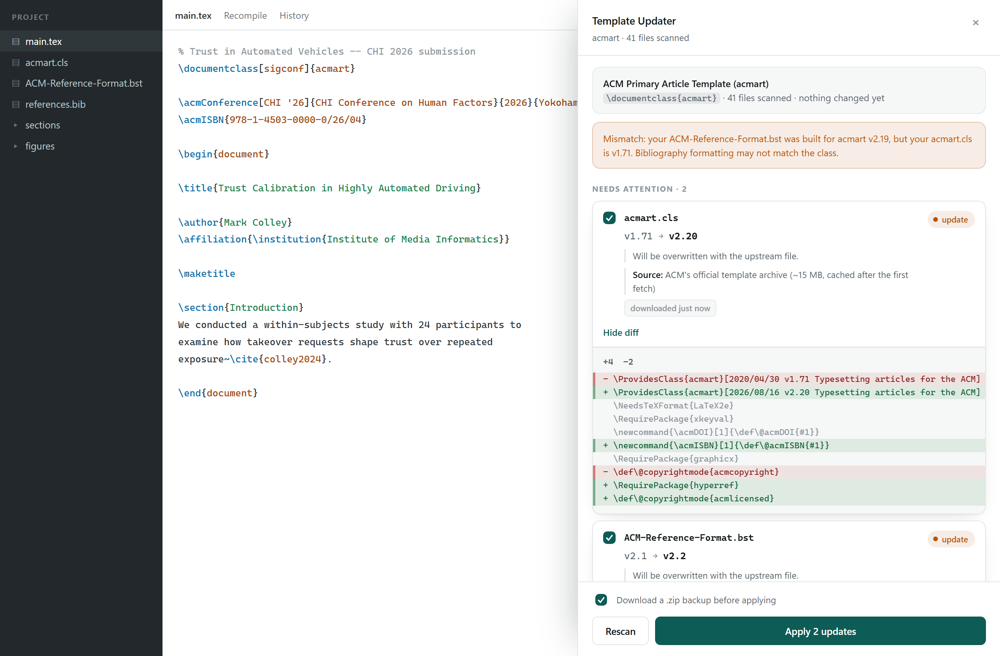
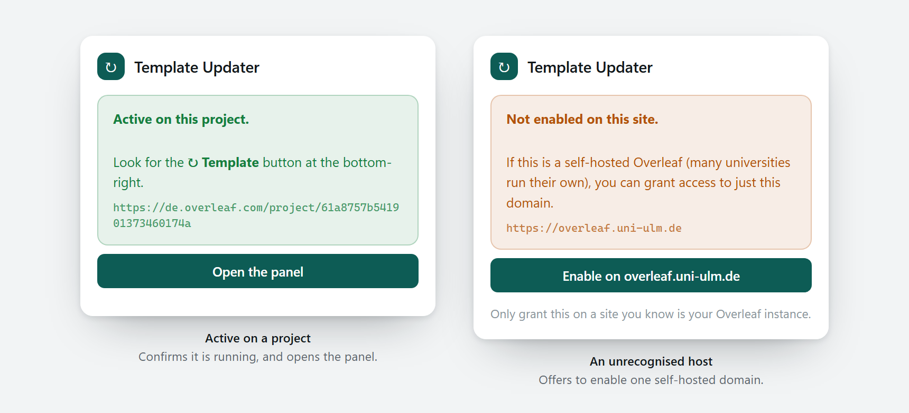
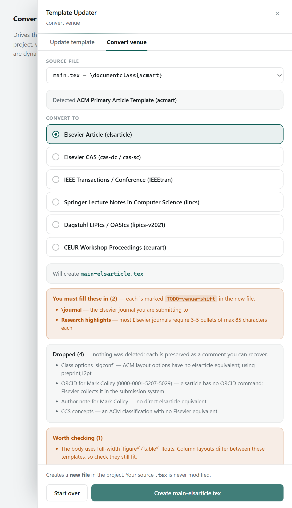

# Template Updater for Overleaf

**Overleaf copies a template into your project once, at creation, and never looks
back.**

When ACM ships a new `acmart`, your CHI submission is still sitting on whatever
version it was forked from — quietly, with no indication anything has changed.
There is no "update template" button, because from Overleaf's point of view your
project isn't a copy of anything. It's just files.

This repo adds one — plus a second tool for when you change venue entirely.

<p align="center">
  <picture>
    <source media="(prefers-color-scheme: dark)" srcset="docs/img/panel-dark.png">
    
  </picture>
</p>

<p align="center"><sub><i>The panel mid-review. The editor behind it is a stand-in — the panel, the version numbers and the diff are the real thing.</i></sub></p>

Three tools, for three situations.

|  | [Chrome extension](#the-chrome-extension) | [`otu` CLI](#the-otu-cli) |
|---|---|---|
| **Works on** | any Overleaf account | needs Overleaf **git access** (paid) |
| **Updates** | template machinery (`.cls`, `.sty`, `.bst`, `.bbx`) | any file, including `main.tex` |
| **Merge model** | file replacement | real **three-way merge** |
| **Your prose** | never touched | merged, conflicts flagged |
| **Setup** | load unpacked, click a button | one `otu init` per project |

And when the venue itself changes — a CHI paper extended into an Elsevier
journal submission — the extension's **Convert venue** tab (and the matching
[`venue-shift`](#venue-shift--moving-a-paper-between-venues) CLI) rewrites the
front matter into a **new** `.tex`, leaving your original untouched.

Use the extension for the common case — *"is my class file stale?"* Use the CLI
when you also want the template's **boilerplate** changes — new preamble macros,
a rewritten conference block — merged into a `main.tex` you have already written
a paper into.

---

## The Chrome extension

### Install

```bash
git clone https://github.com/M-Colley/overleaf-template-updater.git
```

Then in Chrome: `chrome://extensions` → enable **Developer mode** → **Load
unpacked** → select the `extension/` folder.

Open an Overleaf project. A **⟳ Template** button appears bottom-right.

> If a project tab was already open, reload it — content scripts only inject on
> page load. Clicking the extension's toolbar icon tells you exactly what it sees
> on the current tab and offers the fix.

### What it does

Clicking the button runs a **read-only** scan:

1. Downloads the project once (`GET /project/:id/download/zip`) and unpacks it in
   the browser.
2. Identifies the template from `\documentclass{…}` and any bundled `.cls`.
3. Reads each file's version from its `\ProvidesClass` / `\ProvidesFile` header —
   or, for `.bst`, its `%%% version = "…"` block.
4. Looks up the current upstream release and compares.
5. Shows a per-file verdict and a **line-by-line diff of exactly what would
   change**.

Nothing is written until you tick files and press **Apply**.

### What it will and won't touch

It only ever writes **`.cls`, `.sty`, `.bst`, `.bbx`, `.cbx`, `.dbx`** — template
machinery.

**It never rewrites a `.tex` file.** That's where your paper lives, and no
version heuristic is worth the risk. Drift in your own preamble is *reported*,
never silently "fixed". If you want that merged, that's what the CLI is for.

### Safety

- The scan is read-only; nothing changes until you press Apply.
- A `.zip` backup of the project downloads first (toggleable).
- Every change lands in **Overleaf's own History panel**, so it's revertible from
  Overleaf itself.
- Deletions always ask for explicit confirmation.
- Downloaded class files are **verified before use** — see
  [mirrors are not trustworthy](#mirrors-are-not-trustworthy).

### Which Overleaf hosts are covered

Overleaf isn't only `www.overleaf.com`. It serves regional hosts like
`de.overleaf.com`, and universities frequently run **Overleaf Server Pro** on
their own domain.

Covered out of the box: `www.overleaf.com`, bare `overleaf.com`, and any
`*.overleaf.com` subdomain.

For a self-hosted instance on an unrelated domain, open the toolbar popup on that
site and click **Enable on `<host>`**. That uses an *optional* permission, so you
grant one domain at a time rather than the extension demanding access to every
site up front. Everything it does is origin-relative — including the backup
download, which follows the tab you're actually on.

<p align="center">
  <picture>
    <source media="(prefers-color-scheme: dark)" srcset="docs/img/popup-dark.png">
    
  </picture>
</p>

<p align="center"><sub><i>The toolbar popup answers &ldquo;why isn&rsquo;t it showing?&rdquo; directly — it reports what it sees on the current tab and offers the one action that fixes it.</i></sub></p>

### Tracked templates

Twenty-four templates. Every source below was fetched from the live server and
every version read out of the genuine file by the extension's own parser, and
the test suite re-checks all of them on every run.

| Template | Used by | Files | Source |
|---|---|---|---|
| **acmart** | CHI, CSCW, UIST, AutomotiveUI, IMWUT, ACM journals | `acmart.cls`, `ACM-Reference-Format.bst`, `acm{authoryear,numeric}.{bbx,cbx}`, `acmdatamodel.dbx` | ACM's template archive |
| **IEEEtran** | IEEE conferences and journals | `IEEEtran.cls`, `IEEEtran{,S,N,SA,SN}.bst` | CTAN |
| **llncs** | Springer LNCS, INTERACT | `llncs.cls`, `splncs04.bst` | CTAN |
| **Elsevier CAS** | Elsevier journals | `cas-sc.cls`, `cas-dc.cls`, `cas-common.sty`, `cas-model2-names.bst` | CTAN |
| **elsarticle** | Elsevier journals | `elsarticle-{num,harv,num-names}.bst` · `elsarticle.cls` *report only* | CTAN |
| **ACL** | ACL, EMNLP, NAACL, EACL, ARR | `acl.sty`, `acl_natbib.bst` | GitHub `acl-org` |
| **CVPR** | CVPR | `cvpr.sty`, `ieeenat_fullname.bst` | GitHub `cvpr-org` |
| **TMLR** | TMLR | `tmlr.sty`, `tmlr.bst` | GitHub `JmlrOrg` |
| **LIPIcs** / **OASIcs** | ICALP, STACS, SoCG, ESA, CONCUR, ITCS, DISC | `lipics-v2021.cls`, `oasics-v2021.cls` | GitHub `dagstuhl-publishing` |
| **CEUR-WS** | CEUR workshop proceedings | `ceurart.cls` | GitHub `yamadharma/ceurart` |
| **MNRAS** | Monthly Notices of the RAS | `mnras.cls`, `mnras.bst` | CTAN |
| **AASTeX** | ApJ, ApJL, ApJS, AJ, PSJ | `aastex701.cls`, `aasjournalv7.bst` · `aastex63{,1,2}.cls` *report only* | CTAN |
| **OUP** | Oxford University Press journals | `oup-authoring-template.cls`, `oup-{plain,abbrvnat}.bst` | CTAN |
| **ASME** | ASME conferences and journals | `asmeconf.{cls,bst}`, `asmejour.{cls,bst}` | CTAN |
| **JACoW** | IPAC, LINAC, accelerator conferences | `jacow.cls` | CTAN |
| **Quantum** | Quantum | `quantumarticle.cls`, `quantum.bst` | CTAN |
| **IACR** | CiC, ToSC, TCHES | `iacrj.cls` | CTAN |
| **REVTeX**, **APA 7**, **achemso**, **JMLR/PMLR**, **GI LNI** | APS/AIP, APA, ACS, JMLR, GI | `revtex4-2.cls`, `apa7.cls`, `achemso.cls`, `jmlr.cls`, `lni.cls` | *report only* |

ACL, CVPR and TMLR papers are `\documentclass{article}` documents whose template
is a `.sty`, so templates can be detected by the package a paper loads, not
only by its class. *Report only* means the publisher ships no built file — or,
for AASTeX 6, that it was superseded by a differently named class — so the
extension tells you the copy is stale (and, where Overleaf's TeX Live has a
current one, offers to remove the bundled copy) rather than writing anything.

Templates whose files are renamed every year — NeurIPS, ICML, ICLR, AAAI — are
deliberately not tracked: `neurips_2025.sty` has no newer `neurips_2025.sty`
to replace it with.

<details>
<summary><b>Why acmart comes from a 15 MB ACM archive rather than CTAN</b></summary>

Because **there is no compiled `acmart.cls` published anywhere else.** Verified
against the live servers:

- `ctan.org/…/acmart/acmart.cls` → **HTTP 404**. CTAN carries `acmart.dtx` only.
- No `acmart.tds.zip` exists (the usual home for built files).
- `github.com/borisveytsman/acmart` has `.dtx`/`.ins` and **no release assets**.

The `.dtx` is a literate source that has to be run through `docstrip` and LaTeX
to produce a class — something a browser extension cannot do. ACM's own
[proceedings template archive](https://www.acm.org/publications/proceedings-template)
is the only place a built `acmart.cls` is published. It's downloaded once per
session, cached, and only if your project actually bundles a file from it.

`elsarticle` is report-only for the same reason in reverse: `.dtx`-only with no
published built class. So the extension tells you it's stale and suggests
deleting the bundled copy — letting Overleaf's own TeX Live supply a current one
— rather than writing a file it cannot correctly produce.
</details>

### Speed across projects

**The second project you open costs no download at all.** Three things make that
work:

1. The cache stores the **extracted files** (`acmart.cls` is 122 KB), not the
   15 MB archive they came from. The whole cache is a few hundred KB.
2. **One archive download populates every file** the registry sources from it —
   all seven acmart files land together.
3. Freshness is decided by **version tag first**: if CTAN reports acmart v2.20
   and the cached file says v2.20, it's current by definition and nothing is
   fetched. Otherwise a short TTL applies, and past that a conditional request —
   both CTAN and ACM send `ETag`/`Last-Modified`, and ACM answers
   `If-Modified-Since` with an empty **`304`**.

The options page lists everything cached, with versions and sizes, and can clear
it. The test suite *measures* this rather than assuming it: a second scan is
asserted to make zero further archive requests.

### Mirrors are not trustworthy

`ctan.org/tex-archive/…` is a round-robin redirector across community mirrors,
and they are not uniformly healthy. Observed live, in one sitting:

- one mirror returned a **403 HTML error page**;
- another served a valid-looking but **truncated 4 KB `llncs.cls`** in place of
  the real 43 KB file.

A wrong class file silently written into someone's paper is the worst thing this
tool could do. So raw sources carry **explicit mirror fallbacks**, and every
downloaded class is checked with `expectName` — its `\ProvidesClass` name must
match what was requested — before it can ever be offered as an update.

A BibTeX style has no `\ProvidesClass` to check, so a `.bst` must instead
declare its `ENTRY` fields and `READ` the database. A style that never does
cannot produce a bibliography — and `READ` sits near the end of the file, so a
truncated copy fails the check where it would pass every other one.

### Nothing hidden

The options page exists so the privacy claim is *checkable* rather than something
to take on trust: every cached file with its version and size, every template
tracked and the exact URL each one comes from, a one-click reachability test, and
the complete list of hosts the extension may contact.

That host list is **rendered from the allowlist `background.js` actually
enforces**, not restated in the page — a hardcoded copy had already gone stale
the moment CTAN mirror fallbacks were added, and a stale trust claim is worse
than none. A test now fails if `options.html` hardcodes a hostname, or if the
registry points anywhere the allowlist doesn't cover.

<details>
<summary><b>Screenshot of the options page</b></summary>
<br>
<p align="center">
  <picture>
    <source media="(prefers-color-scheme: dark)" srcset="docs/img/options-dark.png">
    
  </picture>
</p>
</details>

---

## The `otu` CLI

The extension replaces files. This does the thing file replacement can't: a real
**three-way merge**, so template changes and your own edits to the same file are
reconciled instead of one clobbering the other.

It keeps an orphan `otu/template` branch holding pristine upstream snapshots and
grafts it into your project's history once with `merge -s ours`. Every later
update is then a genuine three-way merge:

```
base   = the template release you started from
ours   = your paper, as you have edited it
theirs = the new template release
```

```bash
node cli/otu.mjs init --project 65f0a1b2c3d4e5f60718293a \
                      --template https://github.com/borisveytsman/acmart.git
node cli/otu.mjs status
node cli/otu.mjs update --dry-run   # predicts conflicts, changes nothing
node cli/otu.mjs update
node cli/otu.mjs push
```

Requires Overleaf git access: **Account Settings → Git integration → generate a
token**, then use your email as the git username and the token as the password.

### A worked example

Say you started a paper from acmart v1.71 and have since written it. Upstream is
now v2.20, which changed both the class and the boilerplate.

```console
$ otu status
Project   https://git.overleaf.com/61a8757b541901373460174a
Template  https://github.com/borisveytsman/acmart.git
Baseline  v1.71 c5b7c44a
Latest    v2.20 c0e381f7

▲ 1 new template commit(s):
  c0e381f template v2.20: acmISBN macro, hyperref, updated conference block

Files the template changed:
  acmart.cls | 4 +++-
  main.tex   | 3 ++-
  2 files changed, 5 insertions(+), 2 deletions(-)

Run otu update to three-way merge these into your project.
```

Note it says the template changed `main.tex` — that's the boilerplate the
extension deliberately won't touch. Check what that would do to *your* `main.tex`
before committing to it:

```console
$ otu update --dry-run
Would merge template v1.71 → v2.20

Clean merge — no conflicts expected.

(dry run — nothing was changed)
```

Nothing has been written at this point; `--dry-run` uses `git merge-tree`, which
computes the merge without touching the working tree. Now do it:

```console
$ otu update
Advancing template baseline v1.71 → v2.20
Merging template changes into your project…

Auto-merging main.tex
Merge made by the 'ort' strategy.
 acmart.cls | 4 +++-
 main.tex   | 3 ++-
 2 files changed, 5 insertions(+), 2 deletions(-)

✓ Merged cleanly. Review, then: otu push
```

`Auto-merging main.tex` is the whole point: the template's new `\acmISBN` line
and rewritten `\acmConference` block landed in the preamble, while the title and
body you wrote were left alone. Had you edited the same line the template
changed, you would get ordinary conflict markers instead — and `--dry-run` would
have named the file beforehand:

```console
$ otu update --dry-run
Conflicts expected in:
  main.tex

These are files the template changed that you also edited.
Everything else merges automatically.
```

Review with `git diff HEAD~1`, then `otu push` to send it back to Overleaf.

**Verified behaviour.** A project on template v1.71 whose author rewrote the
title and body, against a template shipping v2.20 that changed both the class and
the boilerplate:

- author's title and body text — **preserved**
- template's new `\acmISBN` line and rewritten conference block — **applied**
- `acmart.cls` — **fully upgraded**, including new macros
- where the author had edited the *same line* the template changed — **conflict
  markers**, never silent loss, and `--dry-run` predicts it beforehand without
  touching the working tree

`.otu.json` goes into `.git/info/exclude`, so it's never committed and never
turns up as a stray file inside your Overleaf project.

---

## `venue-shift` — moving a paper between venues

A different problem from keeping a template current: your CHI paper is being
extended into an Elsevier journal submission, or an Elsevier manuscript is being
cut down for an ACM conference. The prose is the same. The front matter is
entirely different furniture, and moving it by hand is a fiddly hour that is
easy to get subtly wrong.

Seven venues, converting between any pair in either direction — forty-two
directions out of fourteen functions:

| | |
|---|---|
| **acmart** | CHI, CSCW, UIST, AutomotiveUI, IMWUT, ACM journals |
| **elsarticle** | Elsevier journals |
| **Elsevier CAS** (`cas-dc`/`cas-sc`) | Elsevier journals on the newer CAS template |
| **IEEEtran** | IEEE conferences and transactions |
| **llncs** | Springer LNCS, INTERACT, many Springer conferences |
| **LIPIcs** / OASIcs | ICALP, STACS, SoCG, ESA and other Dagstuhl proceedings |
| **CEUR-WS** (`ceurart`) | Workshop proceedings — the usual first home of a paper |

It's available **both in the extension and as a CLI**, running the same code —
the venue profiles live in [`extension/lib/venues/`](extension/lib/venues) and
the CLI imports the very same files, so a conversion behaves identically
whichever way you ran it.

### In the extension

Open the panel and switch to the **Convert venue** tab. Pick a source `.tex` and
a target, and you get the migration report and a diff before anything is
written.

<p align="center">
  <picture>
    <source media="(prefers-color-scheme: dark)" srcset="docs/img/convert-dark.png">
    
  </picture>
</p>

### From the command line

```bash
node cli/venue-shift.mjs main.tex       --to elsarticle
node cli/venue-shift.mjs paper.tex      --to ieeetran
node cli/venue-shift.mjs workshop.tex   --to acmart
node cli/venue-shift.mjs --list
```

Two rules make it safe to point at a real paper:

1. **It never modifies your input.** It writes a new `.tex` beside it — in the
   extension, a new file in the project; from the CLI, a new file on disk.
2. **It never rewrites your body.** Everything between the front matter and
   `\end{document}` is copied byte-for-byte — with exactly one exception, the
   argument of `\bibliographystyle`, because leaving `ACM-Reference-Format` in an
   Elsevier submission simply will not compile. The test suite asserts that
   byte-identity in **every one of the 42 directions**, and across a round trip.

Anything the target has no concept of is **preserved as a tagged comment**, never
deleted. Anything the target requires that cannot be derived is scaffolded as a
`TODO-venue-shift` marker and listed in a migration checklist written alongside
the converted file.

An untouched body still has to *compile* under its new class, and the source
class's commands come along with it: ACM requires a `\Description` on every
figure, and IEEEtran has never heard of one. So a body command the target lacks
gets a guarded, do-nothing definition in the new preamble —
`\providecommand{\Description}[2][]{}` — and the body stays byte-identical.

<details>
<summary><b>What it does with a real ACM paper</b></summary>

```console
$ node cli/venue-shift.mjs paper.tex --to elsarticle

Converted  acmart → elsarticle
Written    paper-elsarticle.tex
Checklist  paper-elsarticle-MIGRATION.md

✓ translated automatically (4)
    Dropped `hyperref` from the preamble — the target class loads these itself
    Kept \Description compiling — the target class lacks it, so the preamble
      defines a stand-in; the figure descriptions stay in the source
    Keywords — comma-separated \keywords → \sep-separated keyword environment
    Bibliography style — ACM-Reference-Format → elsarticle-num

▲ dropped, preserved as comments (4)
    Class options `sigconf` — ACM layout options have no elsarticle equivalent
    ORCID for Mark Colley (0000-0001-5207-5029) — Elsevier collects it in the
      submission system
    Author note for Mark Colley — no direct elsarticle equivalent
    CCS concepts — an ACM classification with no Elsevier equivalent

▲ worth checking (1)
    The body uses full-width `figure*`/`table*` floats. Column layouts differ
    between these templates, so check they still fit.

● you must fill these in (2)
    \journal — the Elsevier journal you are submitting to
    Research highlights — most Elsevier journals require 3-5 bullets of max
      85 characters each

  Each is marked TODO-venue-shift in the converted file.
```

</details>

### What actually maps

| Concept | acmart | elsarticle | Elsevier CAS | IEEEtran | llncs | LIPIcs | CEUR-WS |
|---|---|---|---|---|---|---|---|
| front matter | before `\maketitle` | `frontmatter` env | before `\maketitle` | before `\maketitle` | before `\maketitle` | **in the preamble** | before `\maketitle` |
| email | `\email{}` | `\ead{}` | `\ead{}` | `Email:` line | `\email{}` in `\institute` | 3rd `\author` arg | `email=` key |
| affiliation | `\institution{}` … | `organization={}` … | `\affiliation[n]{organization={}}` | free text, `\\` | `\institute` + `\inst{n}` | free text, 2nd arg | `\address[n]{}` free text |
| ORCID | `\orcid{}` | — | `orcid=` key | — | `\orcidID{}` | 4th arg, as a URL | `orcid=` key |
| author note | `\authornote{}` | — | `\cormark` / `\fnmark` | — | `\fnmsep\thanks{}` | `\footnote` on the name | `\cormark` / `\fnmark` |
| title note | — | `\tnotetext` | `\tnotetext` | `\thanks{}` | `\thanks{}` | `\funding{}` | `\tnotetext` |
| keywords | `\keywords{a, b}` | `keyword` env, `\sep` | `keywords` env, `\sep` | `IEEEkeywords` env | `\keywords{}` in the abstract | `\keywords{a, b}` | `keywords` env, `\sep` |
| CCS concepts | `CCSXML` + `\ccsdesc` | — | — | — | — | **`\ccsdesc`** | — |
| highlights | — | `highlights` env | `highlights` env | — | — | — | — |
| CRediT | — | — | `\credit{}` | — | — | — | — |
| bib style | `ACM-Reference-Format` | `elsarticle-num` | `cas-model2-names` | `IEEEtran` | `splncs04` | `plainurl` | `elsarticle-num-names` |

Where a cell is empty the concept is preserved as a tagged comment and listed in
the checklist. What the target requires and nothing can derive — a journal
name, research highlights, CCS concepts for ACM, a CEUR workshop line — is
scaffolded as a `TODO`. The source venue's own identity (`\acmConference`, DOI,
ISBN, a CEUR event line) is never carried: it names the venue you are leaving.

**LIPIcs is the one place CCS concepts survive a change of publisher.** Dagstuhl
classifies papers with ACM's CCS taxonomy, using the very same `\ccsdesc` lines,
so acmart → LIPIcs carries them live, and LIPIcs → acmart carries them back and
flags only the `CCSXML` block ACM additionally wants for its metadata. LIPIcs
also keeps its whole front matter — `\bibliographystyle` included — in the
preamble, so a LIPIcs body has no style line to swap; converting *out* of LIPIcs
writes the target's style into the new preamble instead, or the result would
have no bibliography style at all.

**CEUR-WS has required a "Declaration on Generative AI" section since January
2025.** It belongs in the body, which is never edited, so converting a paper
*to* CEUR-WS flags it as a `TODO` unless the body already has one.

**`natbib` is the `graphicx` trap again.** acmart and ceurart load `natbib`
themselves, so a body full of `\citet` and `\citeauthor` never had to declare
it — and IEEEtran, llncs and LIPIcs don't provide it. It's added in `numbers`
mode, because their styles are numeric and plain `natbib` stops on them.

**llncs links authors to institutions by number.** All authors live in one
`\author{}` and all institutions in one `\institute{}`, both split by `\and`,
joined positionally with `\inst{n}`:

```latex
\author{Mark Colley\inst{1}\orcidID{0000-…} \and Jane Doe\inst{2} \and Alex Roe\inst{1}}
\institute{Institute of Media Informatics, Ulm University, Ulm, Germany\\
\email{mark.colley@uni-ulm.de} \and
Department of Computer Science, Example University, Boston, USA}
```

So parsing has to resolve those indices back out, and *emitting* llncs has to go
the other way — deduplicate identical affiliations and renumber, because three
authors at two institutions must produce two entries, not three. `\keywords` also
lives **inside** the abstract environment in llncs, so it gets lifted out on the
way in and put back on the way out.

One subtlety worth knowing: llncs attaches `\email{}` to the *institution*, not
the person. Two authors sharing an institution share one address in the source,
so carrying it to both would attribute someone else's email to the second author.
Only the first author to claim an institution gets it, and the omission is
reported rather than silent.

**IEEEtran's author blocks are the awkward case.** Where acmart has
`\institution{}`/`\city{}` and elsarticle has `organization={}`, IEEE gives you
free text separated by `\\`, with no marked-up fields at all:

```latex
\IEEEauthorblockA{\textit{Institute of Media Informatics} \\
\textit{Ulm University}\\
Ulm, Germany \\
Email: mark.colley@uni-ulm.de}
```

Splitting that into institution, city, country and email is necessarily a
heuristic: the last comma-bearing line is treated as the place, `Email:` lines
are recognised, and `Massachusetts 02115` splits into state and postcode. It
works on IEEE's own samples — but every affiliation parsed this way is **flagged
for review** rather than presented as reliable, and a US address with no country
line produces a `TODO` rather than a guess.

The honest split: the **mechanics** convert, the **editorial content** cannot.
CCS concepts come from ACM's taxonomy tool, a DOI and ISBN are assigned on
acceptance, and research highlights are three sentences only an author can
write. The tool does the hour of fiddly work and hands you a checklist of the
five minutes that are genuinely yours.

### Adding a venue

Venues are profiles with a `parse()` and an `emit()`, mapping through a shared
intermediate representation ([`extension/lib/venues/ir.js`](extension/lib/venues/ir.js))
— so a new venue costs one parser and one emitter, not a converter per pair.
Seven venues means forty-two conversion directions out of fourteen functions.

A concept the target has no slot for goes through one shared function,
`preserveRest()`, rather than each emitter remembering it. That is not tidiness
for its own sake: a title's funding note (`\thanks{Supported by …}`) used to
vanish silently in four of the original six directions, because two emitters
simply never looked at it. The test suite now runs every fixture through every
direction and asserts the body, every author, the title and any title note all
arrive.

**Packages are reconciled against the target class, in both directions**
([`extension/lib/venues/packages.js`](extension/lib/venues/packages.js)). Getting
this wrong silently corrupts papers either way:

- acmart loads `booktabs`; elsarticle doesn't. Filtering against the *source*
  would strip it from an ACM→Elsevier conversion and break every `\toprule`.
- IEEEtran loads almost nothing. An acmart paper never declares
  `graphicx` — acmart provides it — so converting to IEEEtran must **add** it or
  every `\includegraphics` fails. Nothing in the source document records that
  dependency; it's recoverable only by looking at what the body actually uses.

Both have regression tests. A class's own package list counts only what it
loads *unconditionally*: LIPIcs loads `cleveref` only for its `cleveref`
option, and listing it as provided would strip it from a paper that needs it.

---

## Adding a template

Add an entry to [`extension/registry/templates.json`](extension/registry/templates.json):

```json
{
  "id": "mytemplate",
  "name": "My Conference Template",
  "detect": { "documentclass": ["mycls"], "files": ["mycls.cls"] },
  "upstream": { "version": { "kind": "ctan", "pkg": "mycls" } },
  "files": [{
    "name": "mycls.cls",
    "action": "replace",
    "versionFrom": "provides",
    "expectName": "mycls",
    "source": {
      "kind": "raw",
      "url": "https://ctan.org/tex-archive/.../mycls.cls",
      "mirrors": ["https://ctan.math.illinois.edu/macros/latex/contrib/.../mycls.cls"]
    }
  }]
}
```

- `detect` — any of `documentclass`, `packages` (for a `.sty` template on
  `\documentclass{article}`, like ACL's), or bundled `files`
- `action` — `replace` (a built file exists upstream) or `report-only` (it
  doesn't; say why in `reason`)
- `versionFrom` — `provides`, `bst-header`, `comment-scan`, or `none` for a
  file whose only version-shaped text is somebody else's version (see below)
- `source` — `{kind:"raw", url, mirrors}` or `{ref, member}` into the shared
  `sources` block for archives
- `expectName` — the `\ProvidesClass` name to verify against before writing
- `onlyIfPresent` — list the file only when a project carries it: alternatives
  such as `IEEEtranN.bst`, and superseded classes such as `aastex631.cls`

Then run `npm test`. It fetches every registry source through the real service
worker and checks that the version read out of each class matches the version
CTAN's own index declares — a registry entry that is wrong fails the suite.

The set of hosts the extension may contact is enforced in `background.js`, **not
in the registry**, so editing the registry cannot widen its network reach. A new
host needs a deliberate edit in two places, and `npm test` asserts the two stay
in agreement.

PRs adding templates are welcome.

---

## Development

```bash
npm test
```

Four suites, 388 assertions:

| Suite | Covers |
|---|---|
| `test/run.js` | parsing against real upstream headers, version comparison, diff, registry integrity |
| `test/run-unzip.js` | the ZIP reader, against a real archive |
| `test/run-planner.js` | end-to-end scans through the real service worker, the real ACM archive and live CTAN; every registry source fetched and its version checked against CTAN |
| `test/run-venue-shift.mjs` | all 42 conversion directions, byte-identical bodies, CLI safety |

Add `--offline` to `test/run-planner.js` to skip the network-backed portion.

**Fixtures are the genuine upstream files, not hand-written samples.** That is
how these real bugs got caught:

- `llncs.cls` splits its `\ProvidesClass[…]` **across lines** — a line-anchored
  regex silently reports "unknown version";
- IEEEtran uses a **capital `V` with a letter suffix** (`V1.8b`);
- many classes declare themselves **through macros** — `elsarticle.cls` says
  `\ProvidesClass{\@shortjid}[\RCSdate, \RCSversion: \@journal]`, so the
  elsarticle entry could never report anything but "unknown" until simple
  macros were expanded, and `cas-dc.cls` would have failed `expectName`
  outright as `\RCSfile`;
- TeX swallows the space after a control word, so `jacow.cls`'s
  `[\filedate\space v\fileversion fixes …]` genuinely reads `v2.7fixes` — and a
  version regex finds `2`. Expansion pads, deliberately unlike TeX;
- `ceurart.cls` uses expl3's `\ProvidesExplClass{name}{date}{version}{…}`;
- **license text reads as a version.** Nearly every LaTeX file says "either
  version 1.3c of this license … LaTeX version 1999/12/01", which a comment
  scan reported as v1.3c from 1999. Worse, `splncs04.bst` — already shipped —
  was read as v0.99a from "For use with BibTeX version 0.99a", so an outdated
  copy compared as current. And `mnras.bst`'s first version is its 1995 first
  release. Such files are now `versionFrom: "none"` and compared by content: a
  wrong version is worse than none.

Version comparison is component-wise so `2.20 > 2.9`, and suffix-aware so
`1.8b > 1.8`.

To work on the panel without loading the extension into Chrome, serve the repo
and open `test/preview/index.html` (panel) or `test/preview/popup.html` (popup) —
`test/preview/convert.html` drives the real Convert-venue tab against a fixture
project. All render the actual CSS and JS against mock data:

```bash
python -m http.server 8731
```

The README screenshots are regenerated from `test/preview/screenshot.html` and
`test/preview/screenshot-popup.html` — the same real CSS and JS the extension
ships, captured headless so the images can never drift from the actual UI:

```bash
chrome --headless=new --force-device-scale-factor=2 --window-size=1280,840 --screenshot=docs/img/panel.png http://localhost:8731/test/preview/screenshot.html
```

```bash
chrome --headless=new --force-device-scale-factor=2 --window-size=860,392 --screenshot=docs/img/popup.png http://localhost:8731/test/preview/screenshot-popup.html
```

The options screenshot shows real upstream data, so record it first. This runs
the planner suite and, only if every registry source fetched and verified,
writes each file's size and version and CTAN's declared versions to
`test/preview/options-snapshot.json`:

```bash
node test/run-planner.js --snapshot
```

```bash
chrome --headless=new --force-device-scale-factor=1.5 --window-size=880,5228 --screenshot=docs/img/options.png http://localhost:8731/test/preview/screenshot-options.html
```

The options page reports its own content height in `document.title`, so
`chrome --headless --dump-dom` gives you the exact window height to pass rather
than guessing at it. Measure with the same `--force-device-scale-factor` you
capture with: text wraps differently at 1.5×, and the 1× height leaves a strip
of empty background at the bottom.

Append `?theme=dark` to any of them for the dark variant. It lifts the real
`@media (prefers-color-scheme: dark)` rules out of the stylesheet at runtime
rather than restating any colours, so the dark screenshots follow the palette
automatically.

Package the extension with `python tools/package.py`, which validates the
manifest first and writes a zip to `dist/`.

---

## How it works

Overleaf publishes **no REST API for project contents** — `overleaf.com/devs`
documents only the one-way "Open in Overleaf" `/docs` endpoint. So this speaks
the same internal endpoints the established open-source clients use
([pyoverleaf](https://github.com/jkulhanek/pyoverleaf),
[overleaf-sync](https://github.com/moritzgloeckl/overleaf-sync)), using the
session you're already signed in with. **It never handles your password.**

| Endpoint | Used for |
|---|---|
| `GET /project/:id/download/zip` | read the whole project in one request |
| `WSS /socket.io/…` → `joinProjectResponse` | the only source of folder IDs |
| `POST /project/:id/upload?folder_id=…` | create or overwrite a file |
| `DELETE /project/:id/:type/:entityId` | remove a bundled file |

The scan avoids opening a socket at all; it's only used at apply time.

These endpoints are internal and unversioned. Every call is wrapped in an
explicit status check that fails loudly rather than letting a changed response
shape become a silent no-op on your paper.

---

## Honest limitations

**The write path has not been exercised against a live Overleaf project by the
test suite.** Reading, parsing, upstream fetching, diffing and the whole scan
pipeline are covered end-to-end. The upload and delete calls are implemented from
two independent, actively-maintained open-source clients. Keep the backup
checkbox on for your first run.

**Overleaf can change its internal endpoints without notice.** If a scan starts
failing, that's the first thing to suspect; `extension/lib/overleaf.js` is where
they live.

**ACM's portal fingerprints TLS.** It 403s Node/undici even with a browser
User-Agent, while Chrome and curl pass. The extension is unaffected (it uses
Chrome's stack); the test harness borrows curl to stand in for the browser.

**Version detection is best-effort.** Some `.bst`, `.dbx` and `.sty` files carry
no version at all — `acl.sty` and `tmlr.sty` among them — or carry only somebody
else's. Those fall back to a SHA-256 comparison against upstream — which tells
you *whether* they differ, but not which is newer — and are reported as such,
never pre-selected.

**GitHub-hosted templates have no mirror.** ACL, CVPR, TMLR, LIPIcs and CEUR-WS
are not on CTAN; their publishers maintain them on GitHub, so that is the one
source, and an outage there means "could not reach upstream" for those files.

**Free-text affiliations are split heuristically.** IEEEtran, llncs, LIPIcs and
CEUR-WS write an affiliation as one line of prose. The last part is taken as the
country and the one before as the city (a bare postcode is recognised), and every
affiliation read this way is flagged for review in the checklist.

**Some publishers are not covered.** Springer Nature's `sn-jnl`, MDPI and
Taylor & Francis distribute their templates only as downloads from their own
websites, not from CTAN or a public repository the extension could verify
against; templates renamed every year (NeurIPS, ICML, ICLR, AAAI) cannot be
updated in place at all.

---

## Privacy

No accounts, no analytics, no tracking, no servers of mine. Your project is read
in your own browser and never leaves it. The only outbound requests are to CTAN,
ACM and GitHub, for the public template files themselves — see
[store/PRIVACY.md](store/PRIVACY.md).

## Licence

[MIT](LICENSE) © 2026 Mark Colley.

**No third-party LaTeX templates are redistributed here.** Class files are
fetched at runtime from their publishers and remain under their own terms —
mostly the LPPL; [NOTICE](NOTICE) lists each one.

*Overleaf* is a trademark of Digital Science & Research Solutions Ltd. This
project is not affiliated with, endorsed by, or connected to Overleaf.
